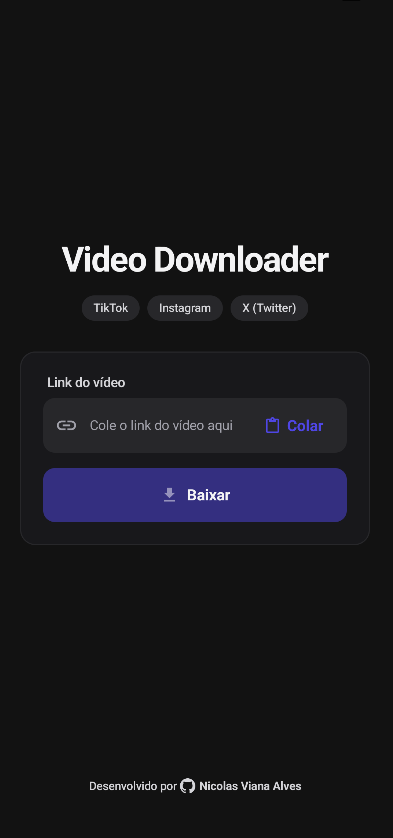

# Social Media Downloader (Android)

👉 **[Veja este README em Português 🇧🇷](README.pt-BR.md)**

A modern, native Android application capable of downloading videos from **TikTok, Instagram, and X (Twitter)** cleanly and without watermarks. This project demonstrates advanced Android development skills, focusing on **Modern Android Architecture**, **Jetpack Compose**, and **UI/UX Design**.

## 🚀 Features

- **Multi-Platform Support:** Download videos from TikTok (via TikWM), Instagram, and X (via RapidAPI).
- **Watermark-Free Downloads:** Fetches and downloads clean video files directly to the device.
- **Modern UI/UX:** Custom-built interface featuring **Glassmorphism**, ambient glow effects, an elegant off-black/off-white color palette, and visual platform badges.
- **Enhanced Input Field:** Smart input field with paste/clear buttons, intelligent validation, and disabled/loading states.
- **Smart Clipboard Integration:** Automatically detects copied links from supported social media platforms.
- **Visual Feedback:** Animated transitions, loading indicators, and modern result cards with intuitive action buttons ("Save", "Share").

## 📸 Preview

<p align="center">
  
</p>

## 🛠 Tech Stack & Architecture

This project follows modern Android development practices, ensuring separation of concerns and a reactive data loop.

- **Language:** Kotlin (100%)
- **UI Framework:** Jetpack Compose (Material Design 3)
- **Architecture:** UDF (Unidirectional Data Flow)
- **Asynchronous Processing:** Coroutines & Flow
- **Networking:** Retrofit 2 + Gson / Hybrid API Approach (TikWM & RapidAPI)
- **Image Loading:** Coil
- **System Integration:** Android DownloadManager API

## 📂 Project Structure

```
com.naicolasdev.tiktokdownloader
├── ui
│   ├── components   # Reusable UI elements
│   ├── home         # Main Screen & Result Cards
│   └── theme        # Custom Design System (Colors, Type, Shapes)
├── data
│   └── api          # API Integrations (TikWM, RapidAPI, Twitter)
├── util
│   └── parser       # Social Media URL Parsers
└── MainActivity.kt  # Entry point
```

## 🔧 How to Run

1. Clone the repository:
   ```bash
   git clone https://github.com/naicolas-dev/tiktok-downloader.git
   ```

2. Open in Android Studio and wait for Gradle to sync.

3. Run the app on a physical device or emulator.

## 📝 License & Disclaimer

This project is for educational and portfolio purposes only.  
It acts as a client for publicly available APIs and is not affiliated with, endorsed by, or connected to TikTok, Instagram, X, or their parent companies.

Please respect the intellectual property rights of content creators and use this tool responsibly.

---

Developed by **Nicolas Viana Alves**
